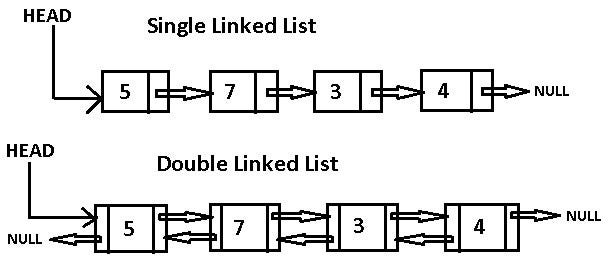
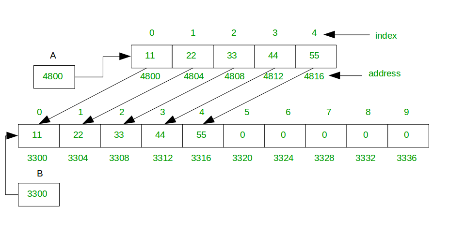
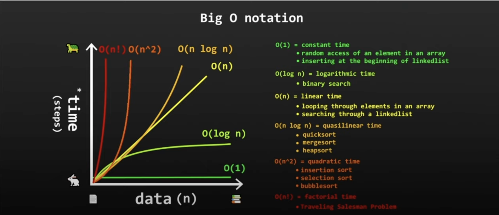

## Stacks


- stack is a LIFO data structure. Last-in First-out.
- stores objects into a sort of "vertical tower"
- `push()`
    - to add to the top
- `pop()`
    - to remove from the top
- `peek()`
    - to look at the object on top
- `search(obj)`
    - to look at the index of the object (index starts at 1, top obj is 1)
- can out of memory

``` java
Stack<String> stack = new Stack<>();
        stack.push("Rdr2");
        stack.push("Skyrim");
        stack.push("Witcher 3");
        stack.push("Gta 6");

        stack.pop(); // this will pop Gta 6

        // Searching for an element
        int position = stack.search("Skyrim");
        
        if(position == -1)
            System.out.println("Element not found");
        else
            System.out.println("Element is found at position: " + position);

        System.out.println("Top element is: " + stack.peek());
```

## Queues


- queue is a FIFO data structure. First-in First-out.
- a collection designed for holding elements prior to processing
- linear data structure
- `offer()`
    - to add, enqueue
- `poll()`
    - to remove, dequeue
- `peek()`
    - to look at the head object

``` java
Queue<String> queue = new LinkedList<>();

        // Using offer() to add elements to the queue
        queue.offer("Rdr2");
        queue.offer("Skyrim");
        queue.offer("Witcher 3");
        queue.offer("Gta 6");

        // Using peek() to look at the head of the queue
        System.out.println("Head element is: " + queue.peek());

        // Using poll() to remove the head of the queue
        System.out.println("Removed element is: " + queue.poll());

        // Using peek() to look at the head of the queue after removal
        System.out.println("Head element after removal is: " + queue.peek());
```

## Priority Queues

- a FIFO data structure that serves elements with the heighest priorities first, before elements with lower priorities
- If the parameter of the priority queue is number, by default sorts it in ascending order
- If it is a String, by default sorts it in alphabetical order

``` java
 PriorityQueue<String> queue = new PriorityQueue<>();

        // Using add() to add elements to the queue
        queue.add("Rdr2");
        queue.add("Skyrim");
        queue.add("Witcher 3");
        queue.add("Gta 6");

        // Using peek() to look at the head of the queue
        System.out.println("Head element is: " + queue.peek());

        // Using poll() to remove the head of the queue
        System.out.println("Removed element is: " + queue.poll());

        // Using peek() to look at the head of the queue after removal
        System.out.println("Head element after removal is: " + queue.peek());
```

## LinkedLists



- stores nodes in: data - address
- nodes are non-consecutive memory locations
- elements are linked using pointers
- can mimic Stacks and Queues
- `add(index, obj)`
    - to add a Node
- `remove(obj)`
    - to remove a Node
- `peekFirst()`
    - to look at head
- `addFirst()`
    - to add to head
- `peekLast()`
    - to look at tail
- `addLast()`
    - to add to tail

``` java
LinkedList<String> linkedList = new LinkedList<>();

        // Using addLast() to add elements to the tail of the list
        linkedList.addLast("Rdr2");
        linkedList.addLast("Skyrim");
        linkedList.addLast("Witcher 3");
        linkedList.addLast("Gta 6");

        // Using peekFirst() to look at the head of the list
        System.out.println("Head element is: " + linkedList.peekFirst());

        // Using remove() to remove the head of the list
        System.out.println("Removed element is: " + linkedList.remove());

        // Using peekFirst() to look at the head of the list after removal
        System.out.println("Head element after removal is: " + linkedList.peekFirst());

        // Using peekLast() to look at the tail of the list
        System.out.println("Tail element is: " + linkedList.peekLast());

        // Using addFirst() to add an element to the head of the list
        linkedList.addFirst("Cyberpunk 2077");
        System.out.println("Head element after adding new is: " + linkedList.peekFirst());
```

## Dynamic Arrays



- we can create an ArrayList to store elements

``` java
ArrayList<> myList = new ArrayList<>();
```

- a for or for-each loop can be used to iterate through elements
- `add()`
    - to add an element
- `get()`
    - to retrieve an element
- `remove()`
    - to remove an element
- `size()`
    - returns the number of elements in our ArrayList
- or instead of using ArrayList we can create our own Dynamic Array

``` java
public class Main{
	
	public static void main(String[] args) {

		DynamicArray dynamicArray = new DynamicArray(5);
		
		dynamicArray.add("A");
		dynamicArray.add("B");
		dynamicArray.add("C");
		
		//System.out.println(dynamicArray.get(0));
		//dynamicArray.insert(0, "X");
		//dynamicArray.delete("A");
		//System.out.println(dynamicArray.search("C"));
		
		System.out.println(dynamicArray);
		System.out.println("size: " + dynamicArray.size);
		System.out.println("capacity: " + dynamicArray.capacity);
		System.out.println("empty: " + dynamicArray.isEmpty());
	}
}
public class DynamicArray {

	int size;
	int capacity = 10;
	Object[] array;
	
	public DynamicArray() {
		this.array = new Object[capacity];
	}
	public DynamicArray(int capacity) {
		this.capacity = capacity;
		this.array = new Object[capacity];
	}
	
        public Object get(int index) {
            return array[index];
        }
	
	public void add(Object data) {
		
		if(size >= capacity) {
			grow();
		}
		array[size] = data;
		size++;
	}
	
	public void insert(int index, Object data) {
		
		if(size >= capacity) {
			grow();
		}
		for(int i = size; i > index; i--) {
			array[i] = array[i - 1];
		}
		array[index] = data;
		size++;
	}
	
	public void delete(Object data) {
		
		for(int i = 0; i < size; i++) {
			if(array[i] == data) {
				for(int j = 0; j < (size - i - 1); j++){
					array[i + j] = array[i + j + 1];
				}
				array[size - 1] = null;
				size--;
				if(size <=(int) (capacity/3)) {
					shrink();
				}
				break;
			}
		}
	}
	
	public int search(Object data) {
		
		for(int i = 0; i < size; i++) {
			if(array[i] == data) {
				return i;
			}
		}
		return -1;
	}
	
	private void grow() {
		
		int newCapacity = (int)(capacity * 2);
		Object[] newArray = new Object[newCapacity];
		
		for(int i = 0; i < size; i++) {
			newArray[i] = array[i];
		}
		capacity = newCapacity;
		array = newArray;
	}
	
	private void shrink() {
		
		int newCapacity = (int)(capacity / 2);
		Object[] newArray = new Object[newCapacity];
		
		for(int i = 0; i < size; i++) {
			newArray[i] = array[i];
		}
		capacity = newCapacity;
		array = newArray;
	}
	
	public boolean isEmpty() {
		return size == 0;
	}
	
	public String toString() {
		
		String string = "";
		
		for(int i = 0; i < capacity; i++) {
			string += array[i] + ", ";
		}
		if(string != "") {
			string = "[" + string.substring(0, string.length() - 2) + "]";
		}
		else {
			string = "[]";
		}
		return string;
	}
}
```

## Big O Notation

`How code slows as data grows.`



- describes performance of an algorithm as the amount of data increases
- machine independent (# of steps to completion)
- ignore smaller operations O(n + 1) -> O(n)

## Linear Search


`RunTime Complexity: O(n)`

- iterate through a collection one element at a time
- `Disadvantages`
    - slow for large data sets
- `Advantages`
    - fast for searches of small to medium data sets
    - does not need to be sorted
    - usefull for data structures that do not have random access (such as LinkedLists)

``` java
private static int linearSearch(int[] array, int value){
    for(int i = 0; i < array.lenght; i++){
        if(array[i] == value) return i;
    }
    return -1;
}
```
