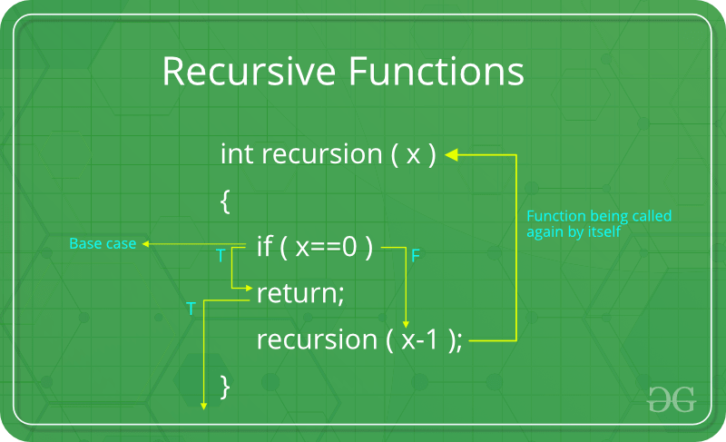
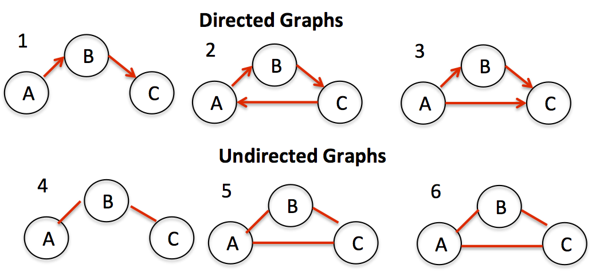

## Stacks


- stack is a LIFO data structure. Last-in First-out.
- stores objects into a sort of "vertical tower"
- `push()`
    - to add to the top
- `pop()`
    - to remove from the top
- `peek()`
    - to look at the object on top
- `search(obj)`
    - to look at the index of the object (index starts at 1, top obj is 1)
- can out of memory

``` java
Stack<String> stack = new Stack<>();
        stack.push("Rdr2");
        stack.push("Skyrim");
        stack.push("Witcher 3");
        stack.push("Gta 6");

        stack.pop(); // this will pop Gta 6

        // Searching for an element
        int position = stack.search("Skyrim");
        
        if(position == -1)
            System.out.println("Element not found");
        else
            System.out.println("Element is found at position: " + position);

        System.out.println("Top element is: " + stack.peek());
```

## Queues


- queue is a FIFO data structure. First-in First-out.
- a collection designed for holding elements prior to processing
- linear data structure
- `offer()`
    - to add, enqueue
- `poll()`
    - to remove, dequeue
- `peek()`
    - to look at the head object

``` java
Queue<String> queue = new LinkedList<>();

        // Using offer() to add elements to the queue
        queue.offer("Rdr2");
        queue.offer("Skyrim");
        queue.offer("Witcher 3");
        queue.offer("Gta 6");

        // Using peek() to look at the head of the queue
        System.out.println("Head element is: " + queue.peek());

        // Using poll() to remove the head of the queue
        System.out.println("Removed element is: " + queue.poll());

        // Using peek() to look at the head of the queue after removal
        System.out.println("Head element after removal is: " + queue.peek());
```

## Priority Queues

- a FIFO data structure that serves elements with the heighest priorities first, before elements with lower priorities
- If the parameter of the priority queue is number, by default sorts it in ascending order
- If it is a String, by default sorts it in alphabetical order

``` java
 PriorityQueue<String> queue = new PriorityQueue<>();

        // Using add() to add elements to the queue
        queue.add("Rdr2");
        queue.add("Skyrim");
        queue.add("Witcher 3");
        queue.add("Gta 6");

        // Using peek() to look at the head of the queue
        System.out.println("Head element is: " + queue.peek());

        // Using poll() to remove the head of the queue
        System.out.println("Removed element is: " + queue.poll());

        // Using peek() to look at the head of the queue after removal
        System.out.println("Head element after removal is: " + queue.peek());
```

## LinkedLists


- stores nodes in: data - address
- nodes are non-consecutive memory locations
- elements are linked using pointers
- can mimic Stacks and Queues
- `add(index, obj)`
    - to add a Node
- `remove(obj)`
    - to remove a Node
- `peekFirst()`
    - to look at head
- `addFirst()`
    - to add to head
- `peekLast()`
    - to look at tail
- `addLast()`
    - to add to tail

``` java
LinkedList<String> linkedList = new LinkedList<>();

        // Using addLast() to add elements to the tail of the list
        linkedList.addLast("Rdr2");
        linkedList.addLast("Skyrim");
        linkedList.addLast("Witcher 3");
        linkedList.addLast("Gta 6");

        // Using peekFirst() to look at the head of the list
        System.out.println("Head element is: " + linkedList.peekFirst());

        // Using remove() to remove the head of the list
        System.out.println("Removed element is: " + linkedList.remove());

        // Using peekFirst() to look at the head of the list after removal
        System.out.println("Head element after removal is: " + linkedList.peekFirst());

        // Using peekLast() to look at the tail of the list
        System.out.println("Tail element is: " + linkedList.peekLast());

        // Using addFirst() to add an element to the head of the list
        linkedList.addFirst("Cyberpunk 2077");
        System.out.println("Head element after adding new is: " + linkedList.peekFirst());
```

## Dynamic Arrays


- we can create an ArrayList to store elements

``` java
ArrayList<> myList = new ArrayList<>();
```

- a for or for-each loop can be used to iterate through elements
- `add()`
    - to add an element
- `get()`
    - to retrieve an element
- `remove()`
    - to remove an element
- `size()`
    - returns the number of elements in our ArrayList
- or instead of using ArrayList we can create our own Dynamic Array

``` java
public class Main{
	
	public static void main(String[] args) {

		DynamicArray dynamicArray = new DynamicArray(5);
		
		dynamicArray.add("A");
		dynamicArray.add("B");
		dynamicArray.add("C");
		
		//System.out.println(dynamicArray.get(0));
		//dynamicArray.insert(0, "X");
		//dynamicArray.delete("A");
		//System.out.println(dynamicArray.search("C"));
		
		System.out.println(dynamicArray);
		System.out.println("size: " + dynamicArray.size);
		System.out.println("capacity: " + dynamicArray.capacity);
		System.out.println("empty: " + dynamicArray.isEmpty());
	}
}
public class DynamicArray {

	int size;
	int capacity = 10;
	Object[] array;
	
	public DynamicArray() {
		this.array = new Object[capacity];
	}
	public DynamicArray(int capacity) {
		this.capacity = capacity;
		this.array = new Object[capacity];
	}
	
        public Object get(int index) {
            return array[index];
        }
	
	public void add(Object data) {
		
		if(size >= capacity) {
			grow();
		}
		array[size] = data;
		size++;
	}
	
	public void insert(int index, Object data) {
		
		if(size >= capacity) {
			grow();
		}
		for(int i = size; i > index; i--) {
			array[i] = array[i - 1];
		}
		array[index] = data;
		size++;
	}
	
	public void delete(Object data) {
		
		for(int i = 0; i < size; i++) {
			if(array[i] == data) {
				for(int j = 0; j < (size - i - 1); j++){
					array[i + j] = array[i + j + 1];
				}
				array[size - 1] = null;
				size--;
				if(size <=(int) (capacity/3)) {
					shrink();
				}
				break;
			}
		}
	}
	
	public int search(Object data) {
		
		for(int i = 0; i < size; i++) {
			if(array[i] == data) {
				return i;
			}
		}
		return -1;
	}
	
	private void grow() {
		
		int newCapacity = (int)(capacity * 2);
		Object[] newArray = new Object[newCapacity];
		
		for(int i = 0; i < size; i++) {
			newArray[i] = array[i];
		}
		capacity = newCapacity;
		array = newArray;
	}
	
	private void shrink() {
		
		int newCapacity = (int)(capacity / 2);
		Object[] newArray = new Object[newCapacity];
		
		for(int i = 0; i < size; i++) {
			newArray[i] = array[i];
		}
		capacity = newCapacity;
		array = newArray;
	}
	
	public boolean isEmpty() {
		return size == 0;
	}
	
	public String toString() {
		
		String string = "";
		
		for(int i = 0; i < capacity; i++) {
			string += array[i] + ", ";
		}
		if(string != "") {
			string = "[" + string.substring(0, string.length() - 2) + "]";
		}
		else {
			string = "[]";
		}
		return string;
	}
}
```

## Big O Notation

`How code slows as data grows.`


- describes performance of an algorithm as the amount of data increases
- machine independent (# of steps to completion)
- ignore smaller operations O(n + 1) -> O(n)

## Linear Search


`RunTime Complexity: O(n)`

- iterate through a collection one element at a time
- `Disadvantages`
    - slow for large data sets
- `Advantages`
    - fast for searches of small to medium data sets
    - does not need to be sorted
    - usefull for data structures that do not have random access (such as LinkedLists)

``` java
private static int linearSearch(int[] array, int value){
    for(int i = 0; i < array.lenght; i++){
        if(array[i] == value) return i;
    }
    return -1;
}
```

## Binary Search


`RunTime Complexity: O(log n)`

- search algorithm that finds the position of a target value within a sorted array
- half of the array is eliminated during each "step"

``` java
private static int binarySearch(int[] array, int target){
int low = 0;
int high = array.length - 1;

while(low <= high){
    int mid = low + (high - low) / 2;
    int value = array[mid];

    if(value < target) low = mid + 1;
    else if(value > target) high = mid - 1;
    else return mid; // Element found
    }
}
```

## Interpolation Search


- `average case: O(log(log(n)))`
- ` worst case: O(n) [values increase exponentially]`

- improvement over binary search best used for "uniformly" distributed data
- guesses where a value might be, based on calculated probe results
-  if probe is incorrect, search area is narrowed, and a new probe is calculated

``` java
private static int interpolationSearch(int[] array, int value) {
		
		int high = array.length - 1;
		int low = 0;
		
		while(value >= array[low] && value <= array[high] && low <= high) {
			
			int probe = low + (high - low) * (value - array[low]) / 
					    (array[high] - array[low]);
			if(array[probe] == value) {
				return probe;
			}
			else if(array[probe] < value) {
				low = probe + 1;
			}
			else {
				high = probe -1;
			}
		}
		
		return -1;
	}
```

## Depth First Search (DFS)


- a search algorithm for traversing a tree or graph data structure
    - pick a route
    - keep going until you reach a dead end, or a previously visited node
    - backtrack to last node that has unvisited adjacent neighbours

``` java
public class Graph {
	
	ArrayList<Node> nodes;
	int[][] matrix;
	
	Graph(int size){
		
		nodes = new ArrayList<>();
		matrix = new int[size][size];
	}
	public void addNode(Node node) {
		
		nodes.add(node);
	}	
	public void addEdge(int src, int dst) {
		
		matrix[src][dst] = 1;
	}	
	public boolean checkEdge(int src, int dst) {
		
		if(matrix[src][dst] == 1) {
			return true;
		}
		else {
			return false;
		}
	}	
	public void print() {	
		
		System.out.print("  ");
		for(Node node : nodes) {
			System.out.print(node.data + " ");
		}
		System.out.println();
		
		for(int i = 0; i < matrix.length; i++) {
			System.out.print(nodes.get(i).data + " ");
			for(int j = 0; j < matrix[i].length; j++) {
				System.out.print(matrix[i][j] + " ");
			}
			System.out.println();
		}
		System.out.println();
	}	
	public void depthFirstSearch(int src) {
		boolean[] visited = new boolean[matrix.length];
		dFSHelper(src, visited);
	}
	private void dFSHelper(int src, boolean[] visited) {
		
		if(visited[src]) {
			return;
		}
		else {
			visited[src] = true;
			System.out.println(nodes.get(src).data + " = visited");
		}
		
		for(int i = 0; i < matrix[src].length; i++) {
			if(matrix[src][i] == 1) {
				dFSHelper(i, visited);
			}
		}
		return;
	}
}
public class Node {

	char data;
	
	Node(char data){
		this.data = data;
	}
}
```

## Breadth First Search


- a search algorithm for traversing a tree or graph data structure
- this is done one "level" at a time, rather than one "branch" at a time

``` java
public class Graph {
	
	ArrayList<Node> nodes;
	int[][] matrix;
	
	Graph(int size){
		
		nodes = new ArrayList<>();
		matrix = new int[size][size];
	}
	public void addNode(Node node) {
		
		nodes.add(node);
	}	
	public void addEdge(int src, int dst) {
		
		matrix[src][dst] = 1;
	}	
	public boolean checkEdge(int src, int dst) {
		
		if(matrix[src][dst] == 1) {
			return true;
		}
		else {
			return false;
		}
	}	
	public void print() {	
		
		System.out.print("  ");
		for(Node node : nodes) {
			System.out.print(node.data + " ");
		}
		System.out.println();
		
		for(int i = 0; i < matrix.length; i++) {
			System.out.print(nodes.get(i).data + " ");
			for(int j = 0; j < matrix[i].length; j++) {
				System.out.print(matrix[i][j] + " ");
			}
			System.out.println();
		}
		System.out.println();
	}	
	public void breadthFirstSearch(int src) {
		
		Queue<Integer> queue = new LinkedList<>();
		boolean[] visited = new boolean[matrix.length];
		
		queue.offer(src);
		visited[src] = true;
		
		while(queue.size() != 0) {
			
			src = queue.poll();
			System.out.println(nodes.get(src).data + " = visited");
			
			for(int i = 0; i < matrix[src].length; i++) {
				if(matrix[src][i] == 1 && !visited[i]) {
					queue.offer(i);
					visited[i] = true;
				}
			}
		}
	}
}
public class Node {

	char data;
	
	Node(char data){
		this.data = data;
	}
}
```

## BFS - DFS

- `Breadth FS`
    - traverse a graph level by level
    - utilizes a queue
    - better if destination is on avarage close to start
    - siblings are visited before childeren
- `Depth FS`
    - traverse a graph branch by branch
    - utilizes a stack
    - better if destination is on avarage far from the start
    - childeren are visited before siblings
    - more popular for games / puzzles

## Recursion
`When a thing is defined in terms of itself`


- apply the result of a procedure to a procedure
- a recursive method calls itself, can be a substitute for iteration
- divide a problem into sub-problems of the same type as the original
- commonly used with advanced sorting algorithms and navigating trees
- `Advantages`
    - easier to read / write
    - easier to debug
- `Disadvantages`
    - sometimes slower
    - uses more memory


``` java
public static int fibonacci(int n) {
        if (n <= 1) {
            return n;
        } else {
            return fibonacci(n - 1) + fibonacci(n - 2);
        }
}
```

## Hash Tables


- a data structure that stores unique keys to values
- each key / value pair is known as entry
- FAST insertion, look up, deletion of key / value pairs
- not ideal for small data sets, great with large ones

- `hashing`
    - takes a key and computes an integer (formula will vary based on index number) -- key.hashCode() % capacity = index
- `bucket`
    - an index storage location for one or more Entries
    - can store multiple Entries in case of a collision (linked similarly to linked list)
- `collision`
    - hash function generates the same index for more than one key
    - less collisions = more efficiency

## Graphs



- `directed graph`
    - a type of graph that contains ordered pairs of vertices
    - edges represents the direction of the vertexes
    - an arrow represents the edges
- `undirected graph`
    - a type of graph that contains unordered pairs of vertices
    - edges do not represents the direction of the vertexes
    - undirected arcs represents the edges

## Adjacency Matrix


- an array to store 1`s and 0`s to represent edges (2D Array)
- '#' of rows =  '#' of unique nodes
- '#' of columns =  '#' of unique nodes

```java
public class Graph {

	ArrayList<Node> nodes;
	int[][] matrix;
	
	Graph(int size){
		nodes = new ArrayList<>();
		matrix = new int[size][size];
	}
	
	public void addNode(Node node) {
		nodes.add(node);
	}
	
	public void addEdge(int src, int dst) {
		matrix[src][dst] = 1;
	}
	
	public boolean checkEdge(int src, int dst) {
		if(matrix[src][dst] == 1) {
			return true;
		}
		else {
			return false;
		}
	}
	
	public void print() {
		System.out.print("  ");
		for(Node node : nodes) {
			System.out.print(node.data + " ");
		}
		System.out.println();
		
		for(int i = 0; i < matrix.length; i++) {
			System.out.print(nodes.get(i).data + " ");
			for(int j = 0; j < matrix[i].length; j++) {
				System.out.print(matrix[i][j] + " ");
			}
			System.out.println();
		}
	}
}
public class Node {

	char data;
	
	Node(char data){
		this.data = data;
	}
}
```

## Adjacency List


- an array / arraylist of linkedlist
- each linkedlist has a unique node at the head
- all adjacent neighbours to that node are added to that node`s linkedlist

```java
public class Graph {

	ArrayList<LinkedList<Node>> alist;
	
	Graph(){
		alist = new ArrayList<>();
	}
	
	public void addNode(Node node) {
		LinkedList<Node> currentList = new LinkedList<>();
		currentList.add(node);
		alist.add(currentList);
	}
	public void addEdge(int src, int dst) {
		LinkedList<Node> currentList = alist.get(src);
		Node dstNode = alist.get(dst).get(0);
		currentList.add(dstNode);
	}
	public boolean checkEdge(int src, int dst) {
		LinkedList<Node> currentList = alist.get(src);
		Node dstNode = alist.get(dst).get(0);
		
		for(Node node : currentList) {
			if(node == dstNode) {
				return true;
			}
		}
		return false;
	}
	public void print() {
		for(LinkedList<Node> currentList : alist) {
			for(Node node : currentList) {
				System.out.print(node.data + " -> ");
			}
			System.out.println();
		}
	}	
}
public class Node {

	char data;
	
	Node(char data){
		this.data = data;
	}
}
```

## Tree Data Structure INFO